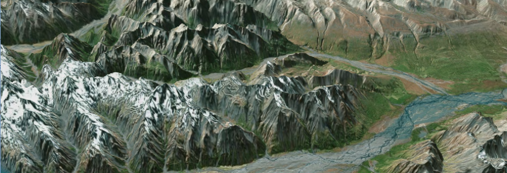

# Creating the tile generation code


*Screenshot generated using the Random Iterator from SRTM data found [Here](http://srtm.csi.cgiar.org/SELECTION/inputCoord.asp)*

Now that we have an understanding of the terrain tile format, and have built some helper methods to navigate around the quadtree and convert between tile, cell and world units, it’s time to read our MRR file and do our first set of optimisations.

The dataset that we are using for our testing and benchmarking is a world MRR that has been stitched together from global SRTM data.  It’s big enough that it will show up in the benchmarks, too.

Because we need to access data at vaaastly different zoom levels, the first thing we’ll try is the random access iterator.  The MRR API uses iterators to provide sequential data access but the random iterator is special precisely because it is setup to provide the value of any cell in the dataset.  This means that all we have to do is convert our WGS84 sample point into a grid cell value at the base resolution, and ask the iterator to retrieve it for us.
```c#
var boundingBox = PointToTile.TileBounds(zoom, tx, ty);
var iterator = dataset.GetRandomIterator(IteratorMode.Read);
iterator.Begin();
//using band 0 in this example.  Be careful with your
//own data as MRR is multifield, multiband
IRandomBand rband = iterator[0];
//get the distance between samples
var dx = (boundingBox.Max.Lon - boundingBox.Min.Lon) / 64;
var dy = (boundingBox.Max.Lat - boundingBox.Min.Lat) / 64;
```
 We are going to find the cell location of the Northwest corner, and use that information plus the grid cell size to determine the cell value of subsequent datapoints. It is **Really Important** and non obvious that cesium is expecting its tiles to be presented from the northwest sample, proceeding easterly, then southerly.  This is easy to handle with the random access iterator but will get harder later!
```c#
for (int lat = 0; lat < 65; lat++)
        	{
            	for (int lon = 0; lon < 65; lon++)
            	{
       	         //read evenly across the whole tile northwest first
                	var wX = boundingBox.Min.Lon + (lon * dx);
                	var wY = boundingBox.Max.Lat - (lat * dy);
```
We are going to first check if the datapoint is inside the MRR bounds before querying the iterator, and afterward we will look at the return value to see if there was a valid value there.  The second check is because the MRR format allows for holes, meaning that it distinguishes between empty and non empty cells.
```c#
 var inside = !GetCellPosition(wX, wY, dataset, out cX, out cY);
 if (inside)
 {
 	rband.GetCellValue((long)cX, (long)cY, out value, out valid);
 }
 else
 {
 	valid = false;
 }

 if (valid)
 {
  	var sValue = Convert.ToUInt16((value + 1000) * 5);
 	var conv = BitConverter.GetBytes(sValue);
 	tile[accum] = conv[0];
 	tile[accum + 1] = conv[1];
 }
 //otherwise, sea level
…
 //don't forget to close the iterator
 iterator.End();
```
outside the tile generator we will have a control loop that, starting with the highest zoom level, creates and saves each tile. The compress and save routine saves the file gzipped into the directory structure that I mentioned in the first post.

```c#
public void WriteTile(int zoom, int tX, int tY, byte[] terrainTile)
    	{
        	var s = ($"{zoom}/{tX}/{tY}.terrain");
        	var terrainPath = Path.Combine(OutDir, s);
        	Directory.CreateDirectory(Path.GetDirectoryName(terrainPath));
        	CompressBytes(terrainPath, terrainTile);
    	}
 
    	public static void CompressBytes(string fileName, byte[] b)
    	{
        	// Use GZipStream to write compressed bytes to target file.
        	using (FileStream f2 = new FileStream(fileName, FileMode.Create))
        	using (GZipStream gz = new GZipStream(f2, CompressionMode.Compress, false))
        	{
			gz.Write(b, 0, b.Length);
        	}
    	}
```


We have a working tile generator, but...
# Performance is not great...

I'll call the basic tilegen method the Naive method.  It was able to process the world dataset in an average of 32 seconds.

<table>
  <tr>
    <td>Method</td>
    <td>Average Time</td>
  </tr>
  <tr>
    <td>naive</td>
    <td>00:31.9</td>
  </tr>
</table>


One really obvious problem with this naive method is that it spends time writing empty files to the hard drive.  We really don’t need to do this as the child byte mask at the end of the tile means we are able to skip tiles that don’t have any data, even if they have a parent or sibling tile that does. We can use the ‘valid’ flag returned from the iterator to make sure we only write tiles that have at least one valid data point:
```c#
 if (valid)

 {

 	**hasData = ****true****;**

 	var sValue = Convert.ToUInt16((value + 1000) * 5);

 	var conv = BitConverter.GetBytes(sValue);

 	tile[accum] = conv[0];

 	tile[accum + 1] = conv[1];

 }
```
If we only write data to file if there is something to write, we save  about 8 seconds:

<table>
  <tr>
    <td>Method</td>
    <td>Average Time</td>
  </tr>
  <tr>
    <td>naive</td>
    <td>00:31.9</td>
  </tr>
  <tr>
    <td>write saving</td>
    <td>00:23.9</td>
  </tr>
</table>


Most of those seconds come from the highest zoom level as [we know that as zoom increases, the ratio of tiles in all lower zoom quads converges on ⅓ ](https://en.wikipedia.org/wiki/1/4_%2B_1/16_%2B_1/64_%2B_1/256_%2B_%E2%8B%AF). As it happens, though, for zoom levels lower than the highest, we need only check whether there is at least one child quad with data.  Given that a tile X<sub>0</sub> and its children, X<sub>1</sub>, X<sub>2</sub>, X<sub>3</sub>, X<sub>4</sub> cover exactly the same area, if none of X<sub>1-4</sub> exist, then X<sub>0</sub> also does not exist, and we can skip all processing.

```c#
if (zoom != maxZoom) { childQuadSwitch = GetChildQuads(zoom, tX, tY, existingTiles); }

//always create tiles with child tiles

bool create = childQuadSwitch > 0 || (zoom == maxZoom);
```
This tile saving method shaves off another three seconds on the world dataset.

<table>
  <tr>
    <td>Method</td>
    <td>Average Time</td>
  </tr>
  <tr>
    <td>naive</td>
    <td>00:31.9</td>
  </tr>
  <tr>
    <td>write saving</td>
    <td>00:23.9</td>
  </tr>
  <tr>
    <td>tile saving</td>
    <td>00:20.9</td>
  </tr>
</table>


Phew! So now we have our first take on the tilegen code, using the simple random access iterator.  It should be obvious that we are not taking advantage of the linear colocation of our datapoints, so [next we will be using the a block based iterator to try and improve our processing speed.](BlockIterator.md)
